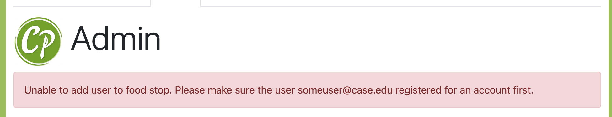

# Food Stop Manager Management
> To perform the functions below, you must be configured as an **administrator** for Campus Plate. Contact your system administrator if you need help having your account setup as an administrator. 

## Overview
* Food stop managers can add listings (items) to food stops, update listings, fulfill orders, and more. Individual people can manage one or several food stops. These instructions will show you how to add food stop managers and remove food stop managers.

## Adding a Food Stop Manager
* To add a food stop manager, the user must be registered with Campus Plate. They can do so easily by accessing the web application (for example https://caslab.case.edu/cp/manage/ for CWRU's deployment) and clicking on the Forgot Password or Creating New Account link as shown below:
****
* Once they register for an account, as an administrator, you can then add them as a Food Stop Manager. Below are the steps:

1. Click on the Admin tab
2. Scroll down to the section "Add a Food Stop Manager"
3. Enter the user's email address
4. Select the appropriate food stop
5. Click on the button "Add User as Food Stop Manager"

> Please note: If you enter an email that the user did not use to register for an account, you will get an error like the one shown below:

## Removing a Food Stop Manager
* To remove a food stop manager, it is just two easy steps.
1. Click on the button "Remove Role" for the food stop manager that you want to remove from a particular food stop:

2. When a popup appears to confirm the removal, click on "delete"

