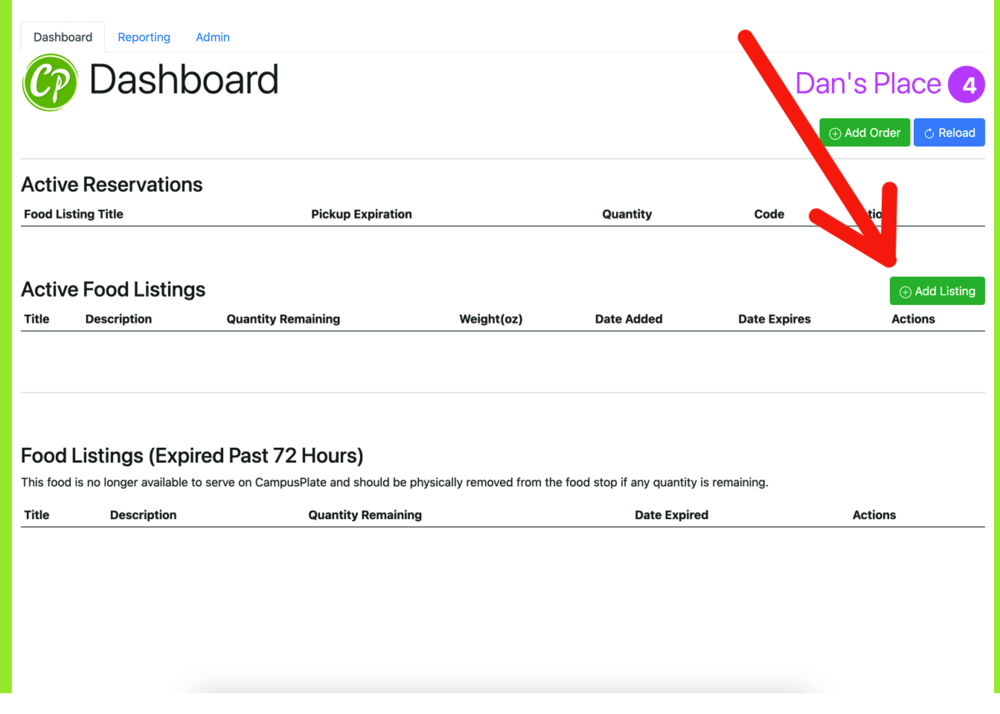
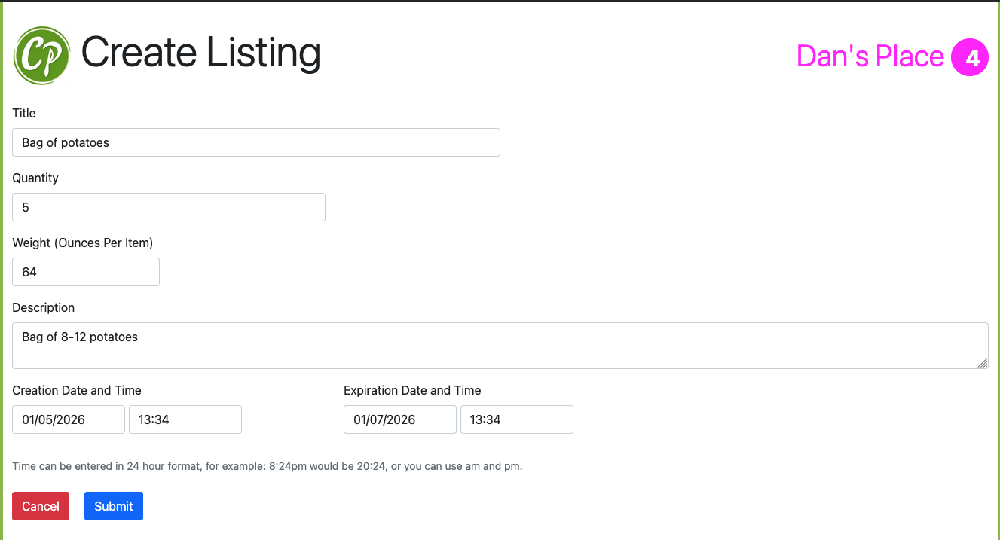
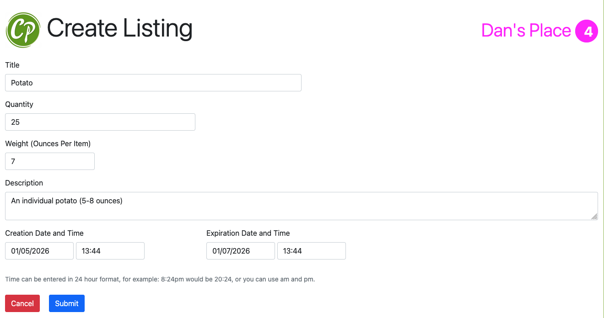
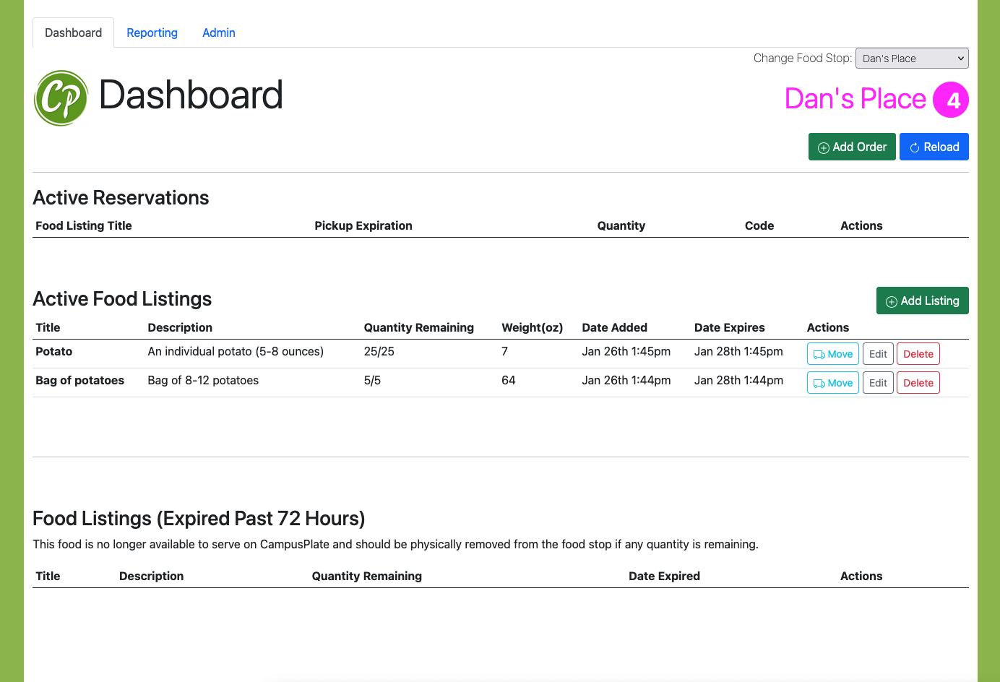
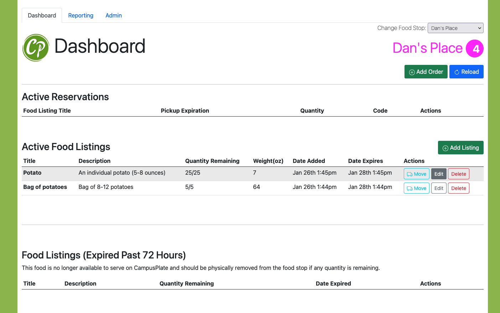
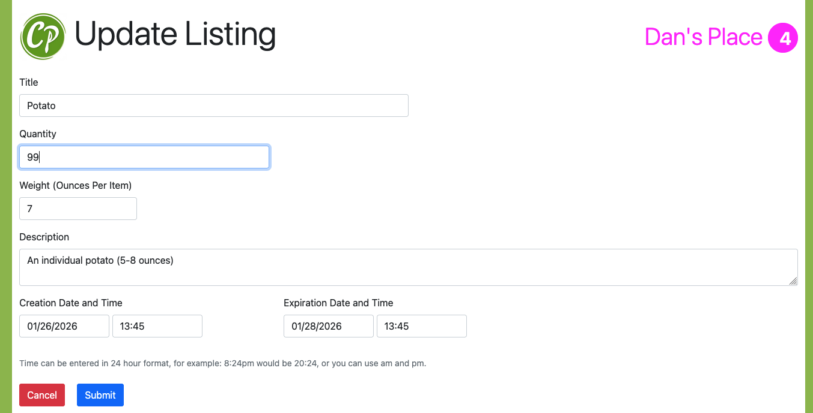
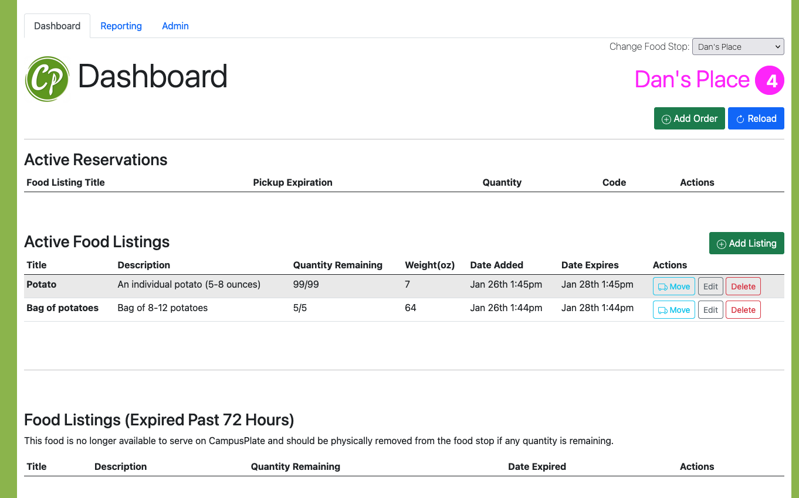
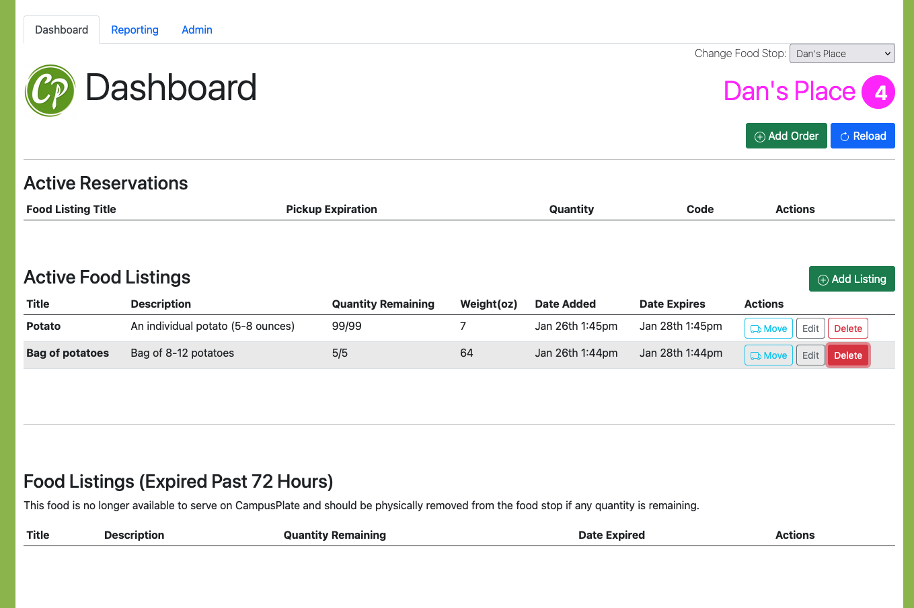
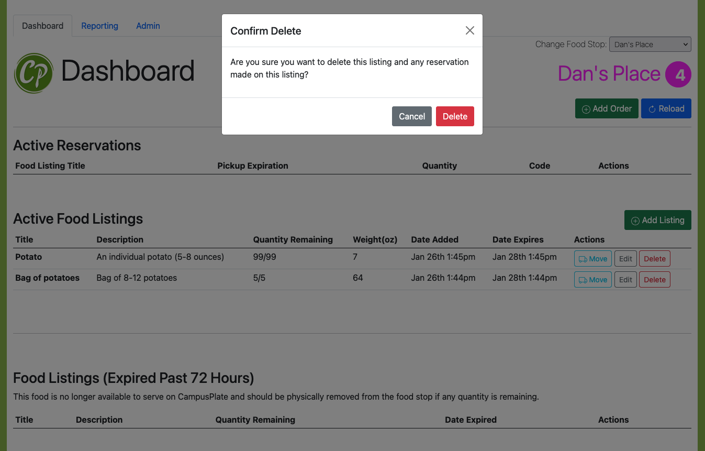
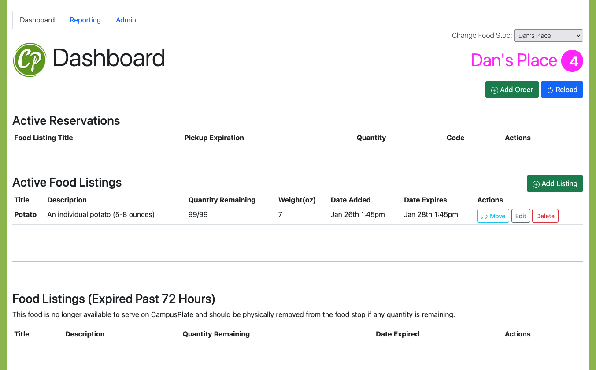

# Campus Plate User Guide
if you're reading this guide, you are either here to learn to sign up for Campus Plate as a **food stop manager**, or you are lost. If you are instead searching for the WebServicesCatalog, [click here](../WebServiceCatalog.md).
> There are three levels of authentication in the campus plate program: 1 an **ordinary user**, who can reserve and pick up food. 2, a **food stop manage**r, who can add food reservations and check people out. 3 an **admin**, who can update the people who are food stop managers.

As a **food stop manager**, you will primarily interact with the app on the *food stop management dashboard*, which is located *online*, not in-app. we recommend a desktop or tablet interface for the website.
# [1] Registering your account
All managers and Admins first need to register for an account.
1. Go to https://caslab.case.edu/cp/passreset.php. 
2. Enter in your email address and ``Continue``.
3. Check your Institute email for a verification code: 
4. Enter the verification code and construct a password. 

Congrats! You are now registered in the database as a user! When you log in, you should see this dashboard:
   

If instead you see this message:
```
Error: You are currently not authorized as a manager of food stops.
```
This means you require the [admin to make you a food stop manager](Admin%20Guide.md). Contact them externally to let them know.

# [2] Managing listings at your food stop
Now that you are a **foodstop manager**, your main usage of this webportal will be adding, updating, and deleting listings.
> A listing refers to any offering that your stop may have.
## 1. Adding a listing 
1. Click on add listing. 

2. Fill out the fields. 
```
Each item is a single unit of food that your food stop gives out. 
e.g. if you are handing out potatoes in a bag vs individual potatoes:
```



```
The expiration date should auto-fill, but you can also manually change it.
```
3. The listings should appear as such:


## 2. Updating a listing
To update incorrect listings, click edit.



## 3. Deleting a listing 
> Note: do NOT delete items when they are recovered. Only delete them if they've been listed incorrectly.





